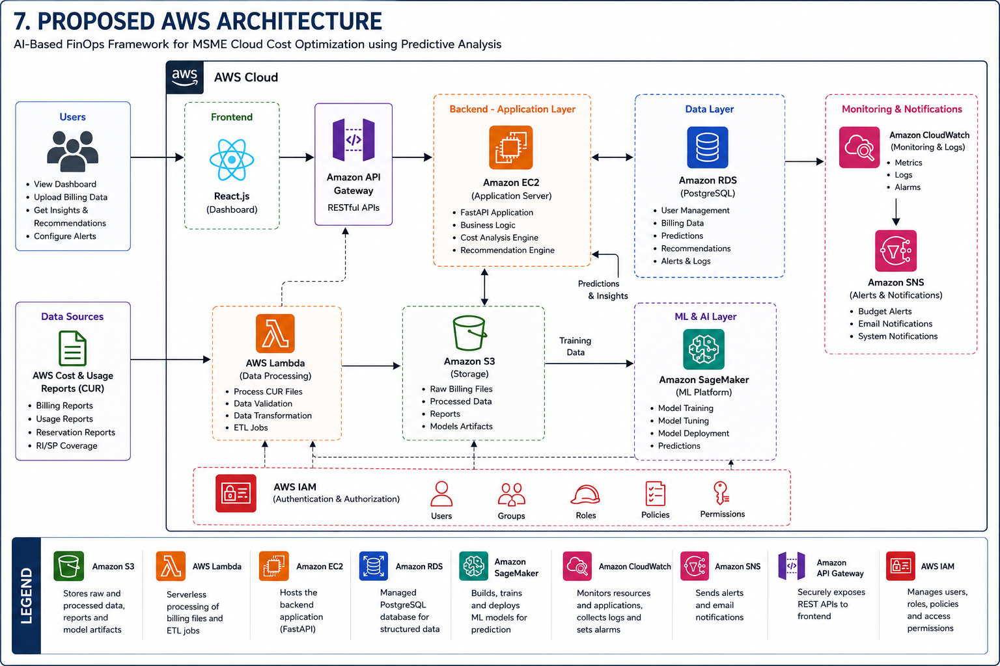
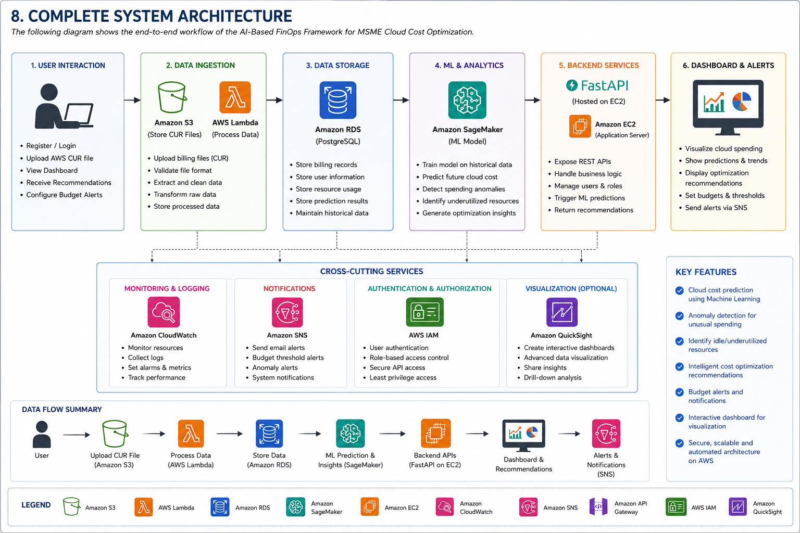

# CloudWise AI - Cloud Architecture Project 2026

## Project Title
**AI-Based FinOps Framework for MSME Cloud Cost Optimization using Predictive Analysis**

---

## Team Members

- Ridhima Singh – Frontend Development
- Rahul Ganesan – Backend & AWS Integration
- Akhilesh Reddy – AI/ML & Predictive Analysis

---

# Problem Statement

Micro, Small, and Medium Enterprises (MSMEs) increasingly rely on cloud platforms such as AWS for hosting applications and storing data. However, many organizations struggle to manage cloud expenses due to dynamic pricing, over-provisioned resources, idle services, and the lack of cost prediction mechanisms. Existing cloud monitoring tools primarily provide historical billing information but offer limited predictive insights and intelligent recommendations.

This project proposes an AI-powered FinOps framework that predicts future cloud expenditure, identifies unnecessary resource utilization, and provides optimization recommendations to reduce operational costs while maintaining performance.

---

# Objectives

- Predict future cloud expenditure using machine learning.
- Detect abnormal cloud spending patterns.
- Recommend intelligent cost optimization strategies.
- Visualize cloud resource utilization using interactive dashboards.
- Improve cloud resource efficiency for MSMEs.
- Integrate AWS cloud services into a scalable architecture.

---

# Technology Stack

## Frontend
- React.js
- Tailwind CSS
- Chart.js

## Backend
- FastAPI
- Python
- REST API

## Database
- PostgreSQL

## AI / Machine Learning
- Pandas
- NumPy
- Scikit-learn
- XGBoost

## Cloud
- Amazon EC2
- Amazon S3
- Amazon RDS
- AWS Lambda
- Amazon SageMaker
- AWS IAM
- CloudWatch
- SNS

---

# Proposed Architecture

## AWS Architecture



## System Architecture



The proposed framework consists of four major layers:

1. User Interface
2. Backend API Layer
3. AI Prediction Engine
4. AWS Cloud Infrastructure

The system collects cloud billing information, stores it securely, predicts future cloud costs using machine learning models, and recommends optimization strategies through an interactive dashboard.

---

# Dataset

Dataset: AWS Cloud Billing Dataset

Source:
AWS Cost and Usage Reports (CUR)

Purpose:
Train AI models to predict future cloud expenditure and identify optimization opportunities.

---

# Repository Structure

```text
CloudWiseAI_Cloud_Project_2026
├── docs
│   ├── Abstract.md
│   ├── DatasetDetails.md
│   ├── LiteratureSurvey.md
│   ├── Novelty.md
│   ├── Objectives.md
│   ├── ResearchGap.md
│   └── TechnologyStack.md
│
├── architecture
│   ├── AWSArchitecture.png
│   ├── SystemArchitecture.png
│   └── README.md
│
├── dataset
│   └── README.md
│
├── presentation
│   └── README.md
│
├── results
│   └── README.md
│
├── src
│   ├── frontend
│   │   └── README.md
│   ├── backend
│   │   └── README.md
│   ├── ml_model
│   │   └── README.md
│   └── aws
│       └── README.md
│
├── LICENSE
├── .gitignore
└── README.md
```

# Current Status

- Repository Structure Completed
- Documentation Completed
- AWS Architecture Completed
- System Architecture Completed
- Literature Survey Completed
- Research Gap Analysis Completed
- Dataset Planning Completed
- Implementation Phase Pending

# Future Scope

- Real-time AWS billing integration
- AI chatbot for FinOps recommendations
- Budget alerts
- Cost anomaly detection
- Automatic cloud optimization suggestions
